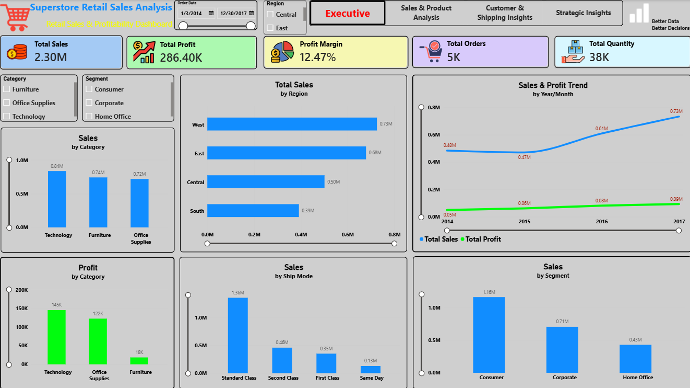
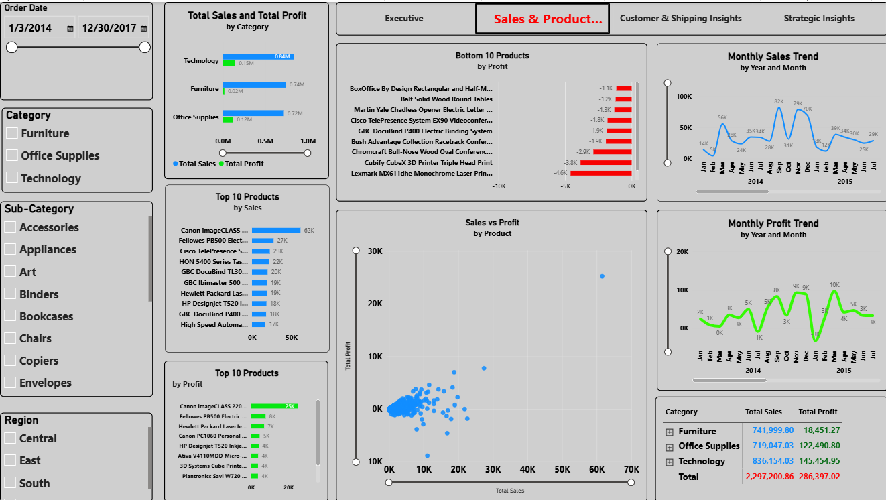
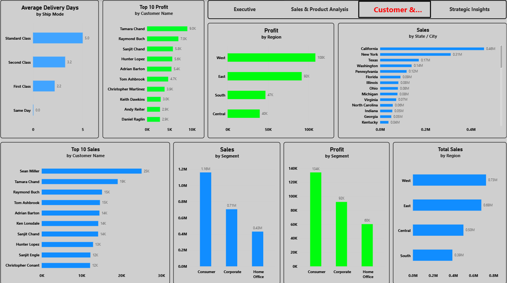
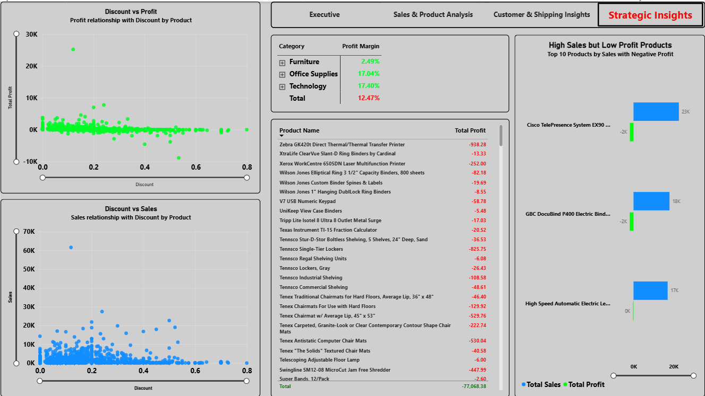

# Superstore Retail Sales Analysis Project

Hey! This is my end-to-end Data Analyst project using the Superstore retail dataset. I worked on the data using Excel, SQL, Python, and Power BI to understand sales, profit, customers, products, regions, shipping, and discount-related performance.

## What I Did

1. **Data Cleaning & Validation:** Cleaned and checked the data using Excel and Power Query. I worked on data types, missing values, duplicates, dates, and other data quality checks.

2. **SQL Analysis:** Imported the cleaned data into MySQL and used SQL queries to analyze sales, profit, customers, products, categories, sub-categories, regions, and other business questions.

3. **Python:** Used Python and Pandas for data processing and working with the cleaned dataset.

4. **Power BI:** Built a 4-page interactive dashboard using DAX, a Calendar table, KPIs, charts, slicers, drill-down, and other dashboard features.

## Project Objective

The main goal of this project was to analyze retail sales data and understand sales performance, profitability, customer behavior, product performance, regional performance, shipping, and discount-related trends.

## Project Workflow

Raw Data → Excel / Power Query → MySQL / SQL → Python / Pandas → Power BI → Business Insights

## Tools Used

- Excel
- Power Query
- MySQL
- SQL
- Python
- Pandas
- Power BI
- DAX

## Power BI Dashboard

The dashboard has 4 pages:

### Page 1: Executive Sales Dashboard

- Total Sales
- Total Profit
- Profit Margin
- Total Orders
- Total Quantity
- Sales & Profit Trend
- Sales by Category
- Profit by Category
- Sales by Region
- Sales by Segment
- Sales by Ship Mode

### Page 2: Sales & Product Analysis

- Monthly Sales Trend
- Monthly Profit Trend
- Category → Sub-Category Analysis
- Top 10 Products by Sales
- Top 10 Products by Profit
- Bottom 10 Products by Profit
- Sales vs Profit

### Page 3: Customer & Shipping Insights

- Top 10 Customers by Sales
- Top 10 Customers by Profit
- Sales and Profit by Segment
- Average Delivery Days by Shipping Mode
- Sales and Profit by Region
- Sales by State / City

### Page 4: Strategic Insights

- Discount vs Profit
- Discount vs Sales
- Profit Margin by Category & Sub-Category
- Loss-Making Products
- High Sales but Low Profit Products

## Key Numbers

- **Total Sales:** $2.30M
- **Total Profit:** $286.40K
- **Profit Margin:** 12.47%
- **Total Records:** 9,994

## Business Insights

- Sales increased overall from 2014 to 2017, although there was a small decline in 2015.
- Profit increased consistently from 2014 to 2017.
- Technology generated the highest sales and profit among the categories.
- West had the highest regional sales and profit.
- Consumer was the largest segment by sales and profit.
- Some high-sales products had low or negative profit.
- Higher discount levels appeared to be associated with lower profitability.
- Furniture had a much lower profit margin than Technology and Office Supplies.
- Some products generated negative profit and need further investigation.

## What I Learned

Through this project, I got practical experience in:

- Data cleaning and validation
- Power Query
- SQL querying and business analysis
- Python and Pandas
- Data modeling in Power BI
- DAX measures
- Time intelligence
- KPI creation
- Interactive dashboard design
- Finding and explaining business insights

## Project Files

- `Excel/` – Excel and cleaned dataset work
- `SQL/` – SQL queries used for analysis
- `Python/` – Python script used for data processing
- `PowerBI/` – Final Power BI dashboard
- `Screenshots/` – Power BI dashboard screenshots

**Author:** Devesh Kumar
